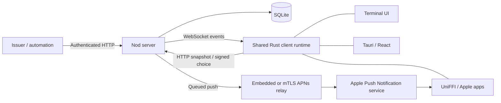

# Nod architecture

Nod runs a decision server backed by SQLite, plus clients that present requests
and sign the user's chosen option. A deployment normally has one server process.
The live event bus is process-local; adding server replicas requires a shared
notification mechanism so mutations on one replica reach sockets on another.
The database remains the authority for a decision.

## Components and ownership

| Component | Responsibility | Entry point |
| --- | --- | --- |
| `nod-server` | Authentication, enrollment, request eligibility, transactional decisions, history, push jobs, admin UI | `server/nod-server/crates/nod-server/src/main.rs` |
| `nod-apns-relay` | APNs provider credentials and Apple transport; embedded library or separate mTLS service | `server/nod-apns-relay/src/main.rs` |
| `nod-proto` | Rust wire types, canonical signing formats, verification and protocol vectors | `nod-proto/src/lib.rs` |
| `nod-client-core` | HTTP, active-server cache, sync reconciliation, signing orchestration, profile/credential persistence | `client/nod-client-core/src/runtime.rs` |
| `nod-client-ffi` | UniFFI bridge to the same Rust client runtime and host signer callbacks | `nod-client-ffi/src/lib.rs` |
| Apple apps | SwiftUI presentation, native lifecycle/notifications, Secure Enclave keys | `client/nod-apple/Apps/NodIOS/NodIOSApp.swift`, `Apps/NodMac/NodMacApp.swift` |
| Tauri desktop | React presentation, native notifications/tray, platform preferences | `client/nod-desktop/src/App.tsx`, `src-tauri/src/lib.rs` |
| TUI | Keyboard state, terminal rendering, terminal alerts, runtime command bridge | `client/nod-tui/src/main.rs` |

Both relay modes use the same APNs mapping and policy. Direct mode keeps Apple
credentials in the server process; remote mode isolates them behind mTLS. They
are mutually exclusive configuration choices.

## Request and decision flow

An issuer creates a request with recipients, content, and options. The server
validates and stores the complete request transactionally, then notifies its
eligible recipients. Shared requests resolve on one accepted choice; per-user
requests record each eligible recipient's choice. Client views can project one
user's state without exposing the complete recipient list.

A client action fetches the authoritative request before signing. The signed
payload binds the request digest, option, text, user/device identity, timestamp,
and nonce. The server checks eligibility and state and records the verified
receipt with the decision. Revoking a device removes authorization while
retaining historical verification material.

Projected requests carry a versioned `signing` context: `nod-request-v2` binds
visible content to an opaque salted recipient commitment. The client recomputes
that digest before signing. The original `request_digest` and v1 verification
vectors remain supported for compatibility. Multi-recipient device projections omit the
legacy digest to avoid revealing a guessable recipient set; single-recipient and
issuer/admin views retain it. Callers must not simply sign a
supplied digest without checking the displayed content. Apple supplies a
Secure Enclave signer callback; software P-256 keys are used by desktop/TUI.

Callbacks are unsigned wake-up hints. A committed decision is returned without
waiting for the callback, and bounded background callback work is best effort.
Consumers authenticate and re-read the decision; a callback is neither a
verification result nor a guaranteed delivery channel.

## Client state and reconnects

Each runtime maintains one active server connection and one complete in-memory
inbox for that server. Selecting a channel filters the cache locally;
`selected_channel_id: null` means all eligible channels. This is not a
cross-server aggregate. Notification actions instead carry an explicit server
identity and can fetch/sign a request without changing the selected profile.
Opening a notification fetches its request and navigates to the right server,
channel, and request.

The sync loop subscribes before fetching HTTP state, then applies buffered
updates. Request timestamps reject older versions; a local revision marker
preserves newer mutations made while a snapshot is in flight. Reconnect and
`resync_required` messages trigger reconciliation inside the runtime. UI shells
receive `connecting`, `reconciling`, `current`, `offline`, or `revoked`, plus the
last successful snapshot time. Pings and a liveness deadline detect silent
connections, and retries use capped backoff with jitter.

Snapshots compare pending IDs to remove obsolete native notifications. Explicit
revocation clears cached content and removes known pending notification IDs.
Native apps also own their delivered-notification lifecycle across process
restarts; the core does not persist the request cache. Decisions are not queued
for offline submission. An uncertain submission result causes an authoritative
fetch so a retry can reflect whether the server already accepted it.

Default refresh returns all pending work and a bounded handled window. Search
and history use the same `/api/v1/requests` endpoint with `channel_id`, `search`,
`before`, and `limit`; the response includes `next_cursor`. The first page
includes matching pending requests; older pages contain handled history ordered
by creation time and ID. Clearing hides handled items for that user, preserves
pending work, and does not delete history; `query_history` includes cleared
items. Retention and eligibility still apply.

## Persistence and security boundaries

The server holds request content and recipient/decision evidence. Client-side
signatures establish what a device signed; they do not establish that the
server or issuer is honest. Device and issuer tokens remain bearer credentials.
Use HTTPS when transport confidentiality is needed outside a trusted local
connection.

Client profile IDs hash canonical server URLs. Migration keeps `credential_id`
aliases so existing OS keyring and Apple keys remain reachable. Config updates
use a file lock, a three-way merge of changed fields, and an atomic temporary
file replacement; a previous valid copy supports recovery from truncation.
The default credential store is the OS keyring. The explicit
`NOD_CLIENT_CORE_INSECURE_TOKEN_STORE=1` mode stores credentials in the local
config; on Unix its files are owner-only. Tests use temporary state and must
not enroll into a developer's real keychain.

Notification redaction controls previews, not server-side access to request
content. Per-device server preferences hide preview content, mute selected
channels, or snooze alerts until a timestamp; these controls preserve inbox
eligibility. The server applies them to APNs, and the core applies them before
emitting local notification candidates. The setter carries an optional server
identity so an open settings sheet cannot modify another server after navigation.
Native shells may also apply local preferences. APNs
provider acceptance means the provider accepted delivery, not that a person
saw the notification. Durable push job status is distinct from authoritative
request status.

## Protocol changes and validation

Rust code shares `nod-proto` directly. TypeScript DTOs and Swift Codable models
are hand-maintained. `scripts/generate-types.sh` generates an ignored TypeScript
projection; `npm run drift-check` compares field names and enum values with the
frontend models. It does not prove type/nullability equivalence. Swift models
are checked by decoding tests and fresh FFI/app builds; Swift wire DTOs are not
generated by typeshare.

A frozen `client/nod-client-core/tests/fixtures/runtime-messages.json` fixture
also crosses the Rust/TypeScript test boundary, guarding serialized message tags,
null/omitted fields, and rendering semantics beyond the projection name check.

The UniFFI wrapper and xcframework are generated from source and ignored by Git.
Rebuild them whenever the Rust runtime, protocol, or FFI changes. Frozen signing
vectors guard historical compatibility even when server and clients change
together. Integration tests must also use the real client signer on projected
requests; manually signing the server's digest would miss content-check errors.

Run `scripts/prepare-test-fixtures` before the Rust suite. CI runs Rust formatting,
Clippy, Linux/macOS tests including their native desktop adapters, Windows client tests, frontend build/tests and
protocol drift, fresh Swift tests, and iOS/macOS compilation. Native OS dialogs,
notifications, hardware signing, and deployment credentials still need the
platform acceptance passes in [release-checklist.md](release-checklist.md).
